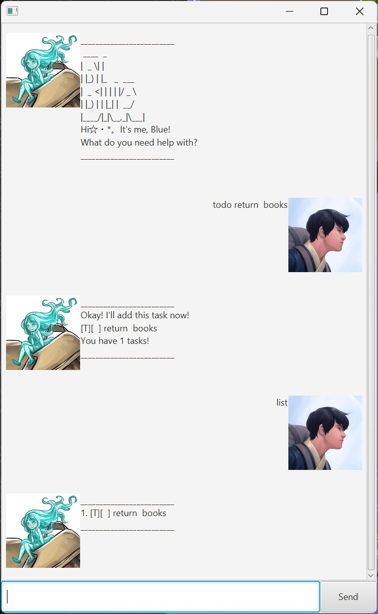

# BlueBot User Guide

BlueBot is a desktop chatbot that helps you manage tasks quickly from plain-text commands.

## Listing all tasks: `list`
Shows a list of all tasks stored.

Format: `list`

## Adding a new ToDo: `todo`
Adds a new todo task to the list.

Format: `todo DESCRIPTION`

Examples:
* `todo Return books to library`
* `todo Math homework`

## Adding a new deadline: `deadline`
Adds a new deadline task to the list.

Format: `deadline DESCRIPTION /by DATE [YYYY MM DD]`

Examples:
* `deadline Internship application /by 2026 3 18`
* `deadline Project submission /by 2026 04 22`

## Adding a new event: `event`
Adds a new event task to the list.

Format: `event DESCRIPTION /by DATE [YYYY MM DD] /to DATE [YYYY MM DD]`

Examples:
* `event Seminar /from 2026 2 21 /to 2026 2 22`
* `event Final exams /from 2026 5 12 /to 2026 5 20`

## Marking a task as done: `mark`
Marks the specified task(s) in the list as done.

Format: `mark INDEX, [INDEX...] ` or `mark all`
* Marks the task at the specified `INDEX`.
* The index refers to the index number shown in the displayed person list.
* The index **must be a positive integer** 1, 2, 3... or all
* Multiple indexes can be used at once if separated by a comma.
* `mark all` marks all tasks as done

Examples:
* `mark 1` marks the 1st task in the list as done.
* `mark 1, 2, 4` marks the 1st, 2nd, 4th task in the list as done.
* `mark all` marks all tasks in the list as done.

## Unmarking a task as done: `unmark`
Unmarks the specified task(s) in the list as done.

Format: `unmark INDEX, [INDEX...] ` or `unmark all`
* Same formatting and usage as the mark command.

Examples:
* `unmark 1` unmarks the 1st task in the list as done.
* `unmark 1, 2, 4` unmarks the 1st, 2nd, 4th task in the list as done.
* `unmark all` unmarks all tasks in the listas done.

## Deleting a task: `delete`
Deletes the specified task(s) from the list.

Format: `delete INDEX, [INDEX...] ` or `delete all`
* Same formatting and usage as the mark command.

Examples:
* `delete 1` deletes the 1st task in the list.
* `delete 1, 2, 4` deletes the 1st, 2nd, 4th task in the list.
* `delete all` deletes all tasks in the list.

## Finding tasks by description: `find`
Finds tasks whose description contain any of the given keywords

Format: `find KEYWORD [MORE_KEYWORDS]`
* The search is case-insensitive. e.g `homework` will match `Homework`
* The order of the keywords does not matter. e.g. `homework complete` will match `complete homework`  
* Only the description is searched. 
* Partial words will be matched e.g. `work` will match `homework` 
* Tasks matching at least one keyword will be returned (i.e. OR search). 
e.g. `books homework` will return `return books`, `complete homework`

Examples:
* `find book` returns `return books` and `buy textbooks`
* `find project books` returns `project meeting` and `return books`

## Exiting Blue Chatbot: `bye`, `exit`, `quit`, `q`
Exits the BlueBot application.

Format: `bye`, `exit`, `quit`, `q`
